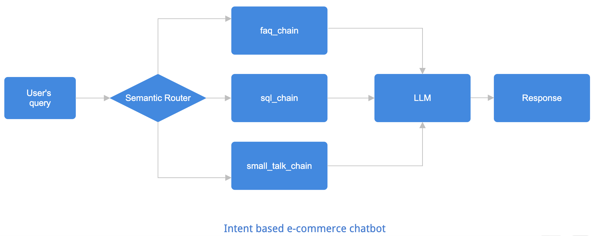

# 💬 E-Commerce Chatbot (Gen AI RAG project using LLama3.3 and GROQ)

An intelligent multi-intent chatbot built using **Groq LLM**, **ChromaDB**, **Streamlit**, and **SQLite**. It serves as a smart assistant for an e-commerce platform and can answer FAQs, perform product searches, and engage in casual conversation.

Currently, the chatbot supports three main intents:

- **faq**: Triggered when users ask questions related to the platform's policies or general information. eg. Is online payment available?
- **sql**: Activated when users request product listings or information based on real-time database queries. eg. Show me all nike shoes below Rs. 3000.
- **small_talk**: Engaged when users ask casual, conversational questions or initiate friendly exchanges with the chatbot. eg. How are you? or Tell me a joke.


## Architecture
<!--  -->


##  Features

-  **Multi-intent Handling** (FAQ, SQL-based product search, and small talk)
-  **Semantic Routing** using sentence transformers
-  **Groq LLM Integration** for natural language understanding and generation
-  **FAQ Knowledge Base** powered by ChromaDB vector search
-  **Dynamic SQL Generation** based on natural queries
-  **Casual Chat** support using Groq for small talk
-  **Streamlit-based UI** for a clean and interactive chat interface

### Set-up & Execution

1. Clone the repository. 

    ```bash
    git clone https://github.com/neethu-codes/E-commerce-chatbot
    cd E-commerce-chatbot
    ```

1. install all dependencies. 

    ```bash
    pip install -r app/requirements.txt
    ```

1. Inside app folder, create a .env file with your GROQ credentials as follows:
    ```text
    GROQ_MODEL=<Add the model name, e.g. llama-3.3-70b-versatile>
    GROQ_API_KEY=<Add your groq api key here>
    ```

1. Run the streamlit app by running the following command.

    ```bash
    streamlit run app/main.py
    ```

### App Screenshot

