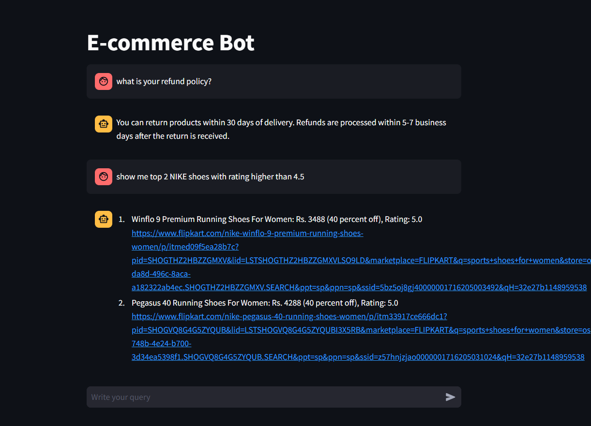

# 💬 E-Commerce Chatbot (Gen AI RAG project using LLama3.3 and GROQ)

This project showcases a proof of concept (POC) for an intelligent chatbot designed for an e-commerce platform. It improves user interaction by accurately understanding queries and providing precise, real-time responses through direct access to the platform's database.

Currently, the chatbot supports three main intents:

- **faq**: Triggered when users ask questions related to the platform's policies or general information. eg. Is online payment available?
- **sql**: Activated when users request product listings or information based on real-time database queries. eg. Show me all nike shoes below Rs. 3000.
- **small_talk**: Activated when users request product listings or information based on real-time database queries. eg. Show me all nike shoes below Rs. 3000.


## Architecture


### Set-up & Execution

1. Run the following command to install all dependencies. 

    ```bash
    pip install -r app/requirements.txt
    ```

1. Inside app folder, create a .env file with your GROQ credentials as follows:
    ```text
    GROQ_MODEL=<Add the model name, e.g. llama-3.3-70b-versatile>
    GROQ_API_KEY=<Add your groq api key here>
    ```

1. Run the streamlit app by running the following command.

    ```bash
    streamlit run app/main.py
    ```

### App Screenshot

